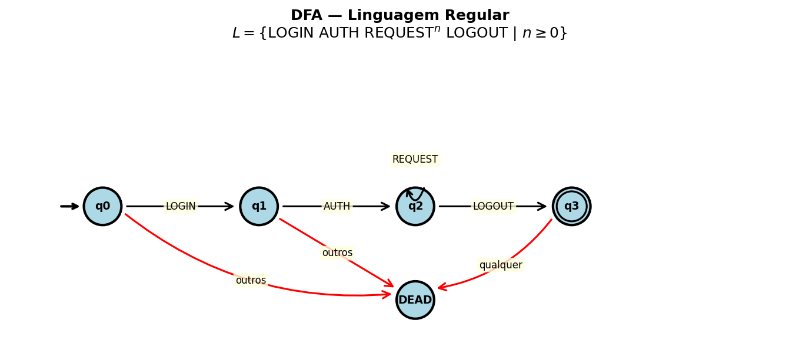
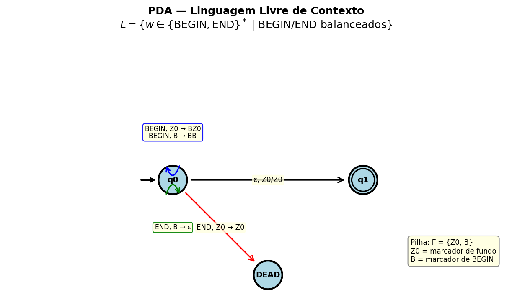
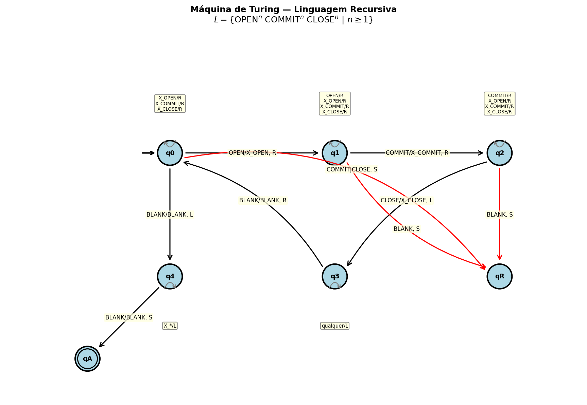

# Validador Formal em Três Níveis

**Tema 2: Validador de Logs e Protocolos**

**Disciplina:** Modelagem Computacional  
**Equipe:**  
- João Antônio de Souza Vieira Sandes
- Gustavo Godoy  

---

## 1. Introdução e Contexto Aplicado

Toda vez que um software decide se uma entrada é válida, ele está reconhecendo uma linguagem formal. Validadores de logs, parsers de protocolo e mecanismos de detecção de intrusão fazem isso constantemente — e diferem fundamentalmente no tipo de problema que conseguem resolver.

Este projeto implementa três reconhecedores formais no domínio de **logs e protocolos de rede**, demonstrando na prática a hierarquia de Chomsky:

$$LR \subsetneq LLC \subsetneq R$$

Cada reconhecedor opera em um nível diferente dessa hierarquia:

| Nível | Classe | Problema | Modelo |
|-------|--------|----------|--------|
| 1 | Linguagem Regular (LR) | Sequência válida de eventos de sessão | DFA |
| 2 | Linguagem Livre de Contexto (LLC) | Blocos de transação aninhados | PDA |
| 3 | Linguagem Recursiva (R) | Trio balanceado de eventos | MT |

O contexto aplicado é a **validação de logs de servidor**: verificar se uma sequência de eventos registrada segue os padrões esperados do protocolo — desde sequências simples de sessão (regular), passando por transações aninhadas (livre de contexto), até a garantia de correspondência tripla entre abertura, confirmação e encerramento de operações (recursiva).

---

## 2. Linguagem Regular — Sequência de Sessão

### 2.1 Descrição

Uma sessão válida de protocolo começa com um evento `LOGIN`, seguido obrigatoriamente de `AUTH` (autenticação), zero ou mais eventos `REQUEST` (requisições), e termina com `LOGOUT`.

### 2.2 Definição Formal

$$L_{LR} = \{ \text{LOGIN} \cdot \text{AUTH} \cdot \text{REQUEST}^n \cdot \text{LOGOUT} \ |\ n \geq 0 \}$$

### 2.3 Alfabeto

$$\Sigma = \{ \text{LOGIN},\ \text{AUTH},\ \text{REQUEST},\ \text{LOGOUT} \}$$

### 2.4 Exemplos

| Cadeia | Resultado | Justificativa |
|--------|-----------|---------------|
| `LOGIN AUTH LOGOUT` | ACEITA | Sessão mínima válida (n=0) |
| `LOGIN AUTH REQUEST LOGOUT` | ACEITA | Uma requisição (n=1) |
| `LOGIN AUTH REQUEST REQUEST REQUEST LOGOUT` | ACEITA | Três requisições (n=3) |
| `LOGIN LOGOUT AUTH` | REJEITA | Ordem incorreta |
| `AUTH LOGIN REQUEST LOGOUT` | REJEITA | Não começa com LOGIN |
| `LOGIN AUTH REQUEST` | REJEITA | Falta LOGOUT final |

### 2.5 Modelo Computacional — DFA

**Estados:** $Q = \{q_0, q_1, q_2, q_3, \text{DEAD}\}$  
**Estado inicial:** $q_0$  
**Estados finais:** $F = \{q_3\}$  

**Tabela de transição:**

| Estado | LOGIN | AUTH | REQUEST | LOGOUT |
|--------|-------|------|---------|--------|
| $q_0$ | $q_1$ | DEAD | DEAD | DEAD |
| $q_1$ | DEAD | $q_2$ | DEAD | DEAD |
| $q_2$ | DEAD | DEAD | $q_2$ | $q_3$ |
| $q_3$ | DEAD | DEAD | DEAD | DEAD |
| DEAD | DEAD | DEAD | DEAD | DEAD |

**Diagrama:**



---

## 3. Linguagem Livre de Contexto — Transações Aninhadas

### 3.1 Descrição

Blocos de transação onde cada `BEGIN` precisa de um `END` correspondente, podendo se aninhar arbitrariamente. Representa transações de banco de dados ou protocolos que permitem operações encapsuladas.

### 3.2 Definição Formal

$$L_{LLC} = \{ w \in \{\text{BEGIN}, \text{END}\}^* \ |\ w \text{ tem BEGIN/END perfeitamente balanceados e aninhados} \}$$

Equivalentemente, a linguagem é gerada pela gramática livre de contexto:

$$S \rightarrow \text{BEGIN}\ S\ \text{END}\ S\ |\ \varepsilon$$

### 3.3 Alfabeto

$$\Sigma = \{ \text{BEGIN},\ \text{END} \}$$

### 3.4 Exemplos

| Cadeia | Resultado | Justificativa |
|--------|-----------|---------------|
| `BEGIN END` | ACEITA | Um bloco simples |
| `BEGIN BEGIN END END` | ACEITA | Aninhamento de profundidade 2 |
| `BEGIN BEGIN BEGIN END END END` | ACEITA | Aninhamento de profundidade 3 |
| `BEGIN END END` | REJEITA | END sem BEGIN correspondente |
| `BEGIN BEGIN END` | REJEITA | BEGIN sem END correspondente |
| `END BEGIN` | REJEITA | Começa com END (desbalanceado) |

### 3.5 Modelo Computacional — PDA

**Estados:** $Q = \{q_0, q_1, \text{DEAD}\}$  
**Estado inicial:** $q_0$  
**Estados finais:** $F = \{q_1\}$  
**Alfabeto da pilha:** $\Gamma = \{Z_0, B\}$  
**Símbolo inicial da pilha:** $Z_0$  

**Transições:**

| Estado | Símbolo | Topo Pilha | Próx. Estado | Operação Pilha |
|--------|---------|------------|--------------|----------------|
| $q_0$ | BEGIN | $Z_0$ | $q_0$ | push $B$ (pilha: $BZ_0$) |
| $q_0$ | BEGIN | $B$ | $q_0$ | push $B$ (pilha: $BB$) |
| $q_0$ | END | $B$ | $q_0$ | pop $B$ |
| $q_0$ | END | $Z_0$ | DEAD | — (erro: END sem BEGIN) |
| $q_0$ | $\varepsilon$ | $Z_0$ | $q_1$ | — (aceita) |

**Aceitação:** estado $q_0$ com pilha contendo apenas $Z_0$ ao final da entrada (equivalente à transição-$\varepsilon$ para $q_1$).

**Diagrama:**



---

## 4. Linguagem Recursiva — Trio Balanceado

### 4.1 Descrição

Uma sequência de exatamente $n$ eventos `OPEN`, seguida de exatamente $n$ eventos `COMMIT`, seguida de exatamente $n$ eventos `CLOSE`. Representa a garantia de que toda operação aberta foi confirmada e encerrada — um padrão impossível de verificar com autômatos com pilha.

### 4.2 Definição Formal

$$L_R = \{ \text{OPEN}^n\ \text{COMMIT}^n\ \text{CLOSE}^n \ |\ n \geq 1 \}$$

### 4.3 Alfabeto

$$\Sigma = \{ \text{OPEN},\ \text{COMMIT},\ \text{CLOSE} \}$$

### 4.4 Exemplos

| Cadeia | Resultado | Justificativa |
|--------|-----------|---------------|
| `OPEN COMMIT CLOSE` | ACEITA | Caso mínimo (n=1) |
| `OPEN OPEN COMMIT COMMIT CLOSE CLOSE` | ACEITA | n=2 |
| `OPEN OPEN OPEN COMMIT COMMIT COMMIT CLOSE CLOSE CLOSE` | ACEITA | n=3 |
| `OPEN COMMIT CLOSE CLOSE` | REJEITA | 1 OPEN, 1 COMMIT, 2 CLOSE |
| `OPEN OPEN COMMIT CLOSE CLOSE` | REJEITA | 2 OPEN, 1 COMMIT, 2 CLOSE |
| `OPEN COMMIT COMMIT CLOSE CLOSE` | REJEITA | 1 OPEN, 2 COMMIT, 2 CLOSE |

### 4.5 Modelo Computacional — Máquina de Turing

**Estados:** $Q = \{q_0, q_1, q_2, q_3, q_4, q_A, q_R\}$  
**Estado inicial:** $q_0$  
**Estado de aceitação:** $q_A$  
**Estado de rejeição:** $q_R$  
**Alfabeto da fita:** $\Gamma = \{\text{OPEN}, \text{COMMIT}, \text{CLOSE}, X_O, X_C, X_{CL}, \sqcup\}$  

**Algoritmo (marcação iterativa):**
1. Encontrar o primeiro `OPEN` não marcado → marcar como $X_O$, mover à direita.
2. Encontrar o primeiro `COMMIT` não marcado → marcar como $X_C$, mover à direita.
3. Encontrar o primeiro `CLOSE` não marcado → marcar como $X_{CL}$, voltar ao início.
4. Repetir até que não haja mais `OPEN` não marcado.
5. Verificar que todos os símbolos estão marcados → aceitar.

**Tabela de transição (principais):**

| Estado | Lê | Escreve | Move | Próx. Estado |
|--------|-----|---------|------|--------------|
| $q_0$ | OPEN | $X_O$ | R | $q_1$ |
| $q_0$ | $X_O, X_C, X_{CL}$ | (mesmo) | R | $q_0$ |
| $q_0$ | $\sqcup$ | $\sqcup$ | L | $q_4$ |
| $q_1$ | COMMIT | $X_C$ | R | $q_2$ |
| $q_1$ | OPEN, $X_O, X_C, X_{CL}$ | (mesmo) | R | $q_1$ |
| $q_2$ | CLOSE | $X_{CL}$ | L | $q_3$ |
| $q_2$ | COMMIT, $X_O, X_C, X_{CL}$ | (mesmo) | R | $q_2$ |
| $q_3$ | (qualquer) | (mesmo) | L | $q_3$ |
| $q_3$ | $\sqcup$ | $\sqcup$ | R | $q_0$ |
| $q_4$ | $X_O, X_C, X_{CL}$ | (mesmo) | L | $q_4$ |
| $q_4$ | $\sqcup$ | $\sqcup$ | S | $q_A$ |

**Diagrama:**



---

## 5. Implementação

### 5.1 Decisões de Projeto

- **Linguagem:** Python 3, sem dependências externas para os reconhecedores.
- **Estrutura de dados:** Tabelas de transição declaradas como dicionários Python (`dict`), com chaves no formato `(estado, símbolo)` para DFA/MT e `(estado, símbolo, topo_pilha)` para o PDA.
- **Não uso de `re`:** Nenhum reconhecedor utiliza o módulo de expressões regulares.
- **Contagem de passos:** Cada aplicação da função de transição incrementa um contador, conforme a definição operacional especificada.
- **Execução autônoma:** Cada reconhecedor aceita entrada via linha de comando e imprime execução passo a passo.

### 5.2 Estrutura dos Módulos

```
src/
├── regular.py          → Simulador de DFA (5 estados, 20 transições)
├── livre_contexto.py   → Simulador de PDA (3 estados, pilha {Z0, B})
├── recursiva.py        → Simulador de MT (7 estados, fita única)
└── testes.py           → Runner que lê testes/*.txt e executa a bateria
```

### 5.3 Execução

```bash
# Bateria completa
python src/testes.py

# Reconhecedores individuais
python src/regular.py "LOGIN AUTH REQUEST LOGOUT"
python src/livre_contexto.py "BEGIN BEGIN END END"
python src/recursiva.py "OPEN OPEN COMMIT COMMIT CLOSE CLOSE"
```

---

## 6. Testes e Resultados

### 6.1 Bateria Completa (Esperado vs Obtido)

#### Nível 1 — Linguagem Regular (DFA)

| Cadeia | Esperado | Obtido | Passos |
|--------|----------|--------|--------|
| `LOGIN AUTH LOGOUT` | ACEITA | ACEITA | 3 |
| `LOGIN AUTH REQUEST LOGOUT` | ACEITA | ACEITA | 4 |
| `LOGIN AUTH REQUEST REQUEST REQUEST LOGOUT` | ACEITA | ACEITA | 6 |
| `LOGIN LOGOUT AUTH` | REJEITA | REJEITA | 3 |
| `AUTH LOGIN REQUEST LOGOUT` | REJEITA | REJEITA | 4 |
| `LOGIN AUTH REQUEST` | REJEITA | REJEITA | 3 |

#### Nível 2 — Linguagem Livre de Contexto (PDA)

| Cadeia | Esperado | Obtido | Passos |
|--------|----------|--------|--------|
| `BEGIN END` | ACEITA | ACEITA | 2 |
| `BEGIN BEGIN END END` | ACEITA | ACEITA | 4 |
| `BEGIN BEGIN BEGIN END END END` | ACEITA | ACEITA | 6 |
| `BEGIN END END` | REJEITA | REJEITA | 3 |
| `BEGIN BEGIN END` | REJEITA | REJEITA | 3 |
| `END BEGIN` | REJEITA | REJEITA | 1 |

#### Nível 3 — Linguagem Recursiva (Máquina de Turing)

| Cadeia | Esperado | Obtido | Passos |
|--------|----------|--------|--------|
| `OPEN COMMIT CLOSE` | ACEITA | ACEITA | 14 |
| `OPEN OPEN COMMIT COMMIT CLOSE CLOSE` | ACEITA | ACEITA | 36 |
| `OPEN OPEN OPEN COMMIT COMMIT COMMIT CLOSE CLOSE CLOSE` | ACEITA | ACEITA | 68 |
| `OPEN COMMIT CLOSE CLOSE` | REJEITA | REJEITA | 10 |
| `OPEN OPEN COMMIT CLOSE CLOSE` | REJEITA | REJEITA | 13 |
| `OPEN COMMIT COMMIT CLOSE CLOSE` | REJEITA | REJEITA | 11 |

**Resultado geral: 18/18 testes passaram.**

### 6.2 Execução Passo a Passo — Cadeia Aceita (DFA)

Entrada: `LOGIN AUTH REQUEST REQUEST LOGOUT`

```
Passo 1: δ(q0, LOGIN) = q1
Passo 2: δ(q1, AUTH) = q2
Passo 3: δ(q2, REQUEST) = q2
Passo 4: δ(q2, REQUEST) = q2
Passo 5: δ(q2, LOGOUT) = q3
Estado final: q3 → ACEITA
```

### 6.3 Execução Passo a Passo — Cadeia Rejeitada (DFA)

Entrada: `LOGIN LOGOUT AUTH`

```
Passo 1: δ(q0, LOGIN) = q1
Passo 2: δ(q1, LOGOUT) = DEAD
Passo 3: δ(DEAD, AUTH) = DEAD
Estado final: DEAD → REJEITA
```

### 6.4 Execução Passo a Passo — Cadeia Aceita (PDA)

Entrada: `BEGIN BEGIN END END`

```
Passo 1: δ(q0, BEGIN, Z0) = (q0, BZ0)   | Pilha: [B, Z0]
Passo 2: δ(q0, BEGIN, B)  = (q0, BB)    | Pilha: [B, B, Z0]
Passo 3: δ(q0, END, B)    = (q0, ε)     | Pilha: [B, Z0]
Passo 4: δ(q0, END, B)    = (q0, ε)     | Pilha: [Z0]
Fim da entrada: pilha = [Z0] → ACEITA
```

### 6.5 Execução Passo a Passo — Cadeia Rejeitada (PDA)

Entrada: `END BEGIN`

```
Passo 1: δ(q0, END, Z0) = (DEAD, Z0)
→ Estado DEAD atingido → REJEITA
```

### 6.6 Execução Passo a Passo — Cadeia Aceita (MT)

Entrada: `OPEN COMMIT CLOSE` (n=1)

```
Passo 1:  δ(q0, OPEN)   = (q1, X_OPEN, R)      Fita: [_ X_O COMMIT CLOSE _]
Passo 2:  δ(q1, COMMIT) = (q2, X_COMMIT, R)     Fita: [_ X_O X_C CLOSE _]
Passo 3:  δ(q2, CLOSE)  = (q3, X_CLOSE, L)      Fita: [_ X_O X_C X_CL _]
Passo 4:  δ(q3, X_C)    = (q3, X_C, L)
Passo 5:  δ(q3, X_O)    = (q3, X_O, L)
Passo 6:  δ(q3, BLANK)  = (q0, BLANK, R)
Passo 7:  δ(q0, X_O)    = (q0, X_O, R)
Passo 8:  δ(q0, X_C)    = (q0, X_C, R)
Passo 9:  δ(q0, X_CL)   = (q0, X_CL, R)
Passo 10: δ(q0, BLANK)  = (q4, BLANK, L)
Passo 11: δ(q4, X_CL)   = (q4, X_CL, L)
Passo 12: δ(q4, X_C)    = (q4, X_C, L)
Passo 13: δ(q4, X_O)    = (q4, X_O, L)
Passo 14: δ(q4, BLANK)  = (qA, BLANK, S)       → ACEITA
```

### 6.7 Execução Passo a Passo — Cadeia Rejeitada (MT)

Entrada: `OPEN COMMIT COMMIT CLOSE CLOSE` (1 OPEN, 2 COMMIT, 2 CLOSE)

```
Passo 1:  δ(q0, OPEN)   = (q1, X_OPEN, R)
Passo 2:  δ(q1, COMMIT) = (q2, X_COMMIT, R)
Passo 3:  δ(q2, COMMIT) = (q2, COMMIT, R)
...
Passo 10: δ(q0, COMMIT) = (qR, COMMIT, S)      → REJEITA
```

O reconhecedor detecta COMMIT não marcado em q0 (onde espera-se apenas símbolos marcados ou OPEN), rejeitando corretamente.

---

## 7. Comparação entre os Três Níveis da Hierarquia

### 7.1 Poder Computacional

| Aspecto | DFA (LR) | PDA (LLC) | MT (R) |
|---------|----------|-----------|--------|
| Memória auxiliar | Nenhuma | Pilha (LIFO) | Fita infinita |
| Leitura da entrada | Uma passada, esquerda→direita | Uma passada | Múltiplas passadas |
| Capacidade de contar | Não conta | Conta 1 grupo | Conta n grupos |
| Complexidade de tempo | $O(n)$ | $O(n)$ | $O(n^2)$ |

### 7.2 Crescimento do Número de Passos

| Tamanho da entrada | DFA (passos) | PDA (passos) | MT (passos) |
|--------------------|--------------|--------------|-------------|
| n=1 (3 tokens) | 3 | 2 | 14 |
| n=2 (6 tokens) | — | 4 | 36 |
| n=3 (9 tokens) | 6 | 6 | 68 |

**Análise:**
- **DFA:** Cresce linearmente — exatamente 1 passo por token. $T(k) = k$ onde $k$ = número de tokens.
- **PDA:** Cresce linearmente — exatamente 1 passo por token. $T(k) = k = 2n$.
- **MT:** Cresce **quadraticamente** — $T(n) \approx O(n^2)$. Para n=1: 14 passos; n=2: 36; n=3: 68. A MT precisa percorrer a fita múltiplas vezes (n iterações completas), e cada varredura percorre $\approx 3n$ células.

Essa diferença ilustra concretamente que maior poder computacional tem um custo: a MT resolve problemas que DFA e PDA não conseguem, mas com complexidade significativamente maior.

### 7.3 Por que a LLC não é Regular?

A linguagem $L_{LLC} = \{BEGIN^n\ END^n\ |\ n \geq 1\}$ **não é regular**. Prova pelo Lema do Bombeamento:

Suponha, por contradição, que $L_{LLC}$ é regular com constante de bombeamento $p$.

Considere $w = BEGIN^p\ END^p \in L_{LLC}$, com $|w| \geq p$.

Pelo Lema do Bombeamento, $w = xyz$ com:
1. $|xy| \leq p$
2. $|y| \geq 1$
3. $xy^iz \in L_{LLC}$ para todo $i \geq 0$

Como $|xy| \leq p$, a substring $y$ contém apenas símbolos BEGIN. Logo $y = BEGIN^k$ para algum $k \geq 1$.

Para $i = 2$: $xy^2z = BEGIN^{p+k}\ END^p$, que tem mais BEGINs que ENDs.

Portanto $xy^2z \notin L_{LLC}$, contradição. Logo $L_{LLC}$ **não é regular**. $\blacksquare$

### 7.4 Por que a Recursiva não é Livre de Contexto?

A linguagem $L_R = \{OPEN^n\ COMMIT^n\ CLOSE^n\ |\ n \geq 1\}$ **não é livre de contexto**. Prova pelo Lema do Bombeamento para LLCs:

Suponha que $L_R$ é LLC com constante $p$.

Considere $w = OPEN^p\ COMMIT^p\ CLOSE^p$, com $|w| \geq p$.

Pelo Lema do Bombeamento para LLCs, $w = uvxyz$ com:
1. $|vxy| \leq p$
2. $|vy| \geq 1$
3. $uv^ixy^iz \in L_R$ para todo $i \geq 0$

Como $|vxy| \leq p$, a substring $vxy$ não pode conter simultaneamente OPENs e CLOSEs (estão separados por $p$ COMMITs). Logo $v$ e $y$ contêm no máximo **dois** dos três tipos de símbolo.

Para $i = 2$: $uv^2xy^2z$ terá contagens desiguais entre OPEN, COMMIT e CLOSE.

Portanto $uv^2xy^2z \notin L_R$, contradição. Logo $L_R$ **não é livre de contexto**. $\blacksquare$

---

## 8. Comparação: DFA Manual vs Módulo `re` (Bônus)

A linguagem regular $L_{LR}$ pode ser expressa pela regex:

```
^LOGIN AUTH( REQUEST)* LOGOUT$
```

Comparação entre a abordagem manual (DFA) e `re.fullmatch()`:

| Aspecto | DFA Manual | `re` do Python |
|---------|-----------|----------------|
| Transparência | Total (estados visíveis) | Caixa-preta (engine PCRE) |
| Contagem de passos | Explícita | Não disponível |
| Didática | Alta | Baixa |
| Desempenho | $O(n)$ determinístico | $O(n)$ na prática, pode ser exponencial em regex complexas |
| Poder expressivo | Exatamente linguagens regulares | Supera LR (backreferences) |

O `re` do Python usa um motor NFA/backtracking que pode reconhecer linguagens **além** das regulares (via backreferences), mas para linguagens estritamente regulares, ambos produzem o mesmo resultado.

---

## 9. Conclusão e Limitações

### Conclusão

O projeto demonstrou na prática a hierarquia de Chomsky através de reconhecedores manuais para três linguagens no domínio de logs e protocolos:

1. O **DFA** resolve eficientemente problemas de sequenciamento com memória finita.
2. O **PDA** estende esse poder com uma pilha, permitindo verificar balanceamento.
3. A **MT** é necessária quando se precisa garantir igualdade entre três ou mais contadores — algo impossível tanto para DFA quanto para PDA.

A diferença é também quantitativa: enquanto DFA e PDA processam em $O(n)$, a MT necessita $O(n^2)$ passos para o algoritmo de marcação, evidenciando o custo computacional do poder adicional.

### Limitações

- A MT implementada usa um algoritmo de marcação de complexidade $O(n^2)$; existem variantes com múltiplas fitas que reduziriam para $O(n \log n)$.
- O PDA aceita a cadeia vazia como vacuamente balanceada — uma escolha de design que poderia ser alterada conforme requisitos do domínio.
- Os diagramas foram gerados programaticamente via matplotlib; ferramentas como JFLAP ou TikZ produziriam representações mais canônicas.
- O projeto não implementa análise de faixas numéricas (ex: validar 0–255 em IPv4), pois isso descaracterizaria o DFA.

---

## Referências

- SIPSER, M. *Introduction to the Theory of Computation*. 3ª ed. Cengage, 2012.
- HOPCROFT, J. E.; MOTWANI, R.; ULLMAN, J. D. *Introduction to Automata Theory, Languages, and Computation*. 3ª ed. Pearson, 2006.
